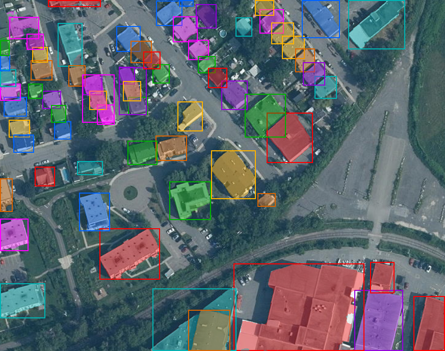

# SAM 3.1: Segment Anything Model 3.1 in GoMLX

This package implements the **image grounding / segmentation** part of Facebook's
**SAM 3.1** foundation model, designed to run in Go using
[GoMLX](https://github.com/gomlx/gomlx) for hardware-accelerated tensor
computations.

It implements the image part of the model (the ViT-Det vision backbone, ViTDet
neck, CLIP-style text encoder, DETR-style transformer encoder/decoder, geometry
encoder, and universal segmentation head). The video tracking part (Object
Multiplex) is **not** implemented.


## Methodoly

Using DeepSeek V4 Pro, tasked to implement the GoMLX SAM3 version based on the Facebook implementations.
Cost: 0.60$

## References
* **Model**: [facebook/sam3.1](https://huggingface.co/facebook/sam3.1)
* **Reference PyTorch Implementation**: [facebookresearch/sam3](https://github.com/facebookresearch/sam3)
* **Paper**: [SAM 3](https://arxiv.org/abs/2511.16719)

## Checkpoint

The official `sam3.1_multiplex.pt` checkpoint is a gated PyTorch pickle. This
package loads a **bf16 safetensors** conversion instead, e.g.
[dummy9996/SAM3.1-safetensors-bf16-x-fp8](https://huggingface.co/dummy9996/SAM3.1-safetensors-bf16-x-fp8)
(`sam3.1_multiplex_bf16.safetensors`).

The BPE vocabulary (`bpe_simple_vocab_16e6.txt.gz`) ships with the reference
`sam3` package under `sam3/assets/` and must be provided to `NewSegmenter`.

## API

### High-level segmenter
* **[NewSegmenter](file:///models/sam3/sam3.go)**: loads the config/weights,
  compiles the computation graph, and returns a `*Segmenter`.
* **[Segment](file:///models/sam3/sam3.go)**: runs inference and returns
  `[]Detection` (binary masks, bounding boxes, and scores) sorted by score.

### Low-level graph API
* **[Forward](file:///models/sam3/sam3.go)**: builds the full SAM 3.1 image
  grounding graph from `*Node` inputs.

## Usage

```go
backend, _ := compute.New()
defer backend.Finalize()

repo := hub.New("dummy9996/SAM3.1-safetensors-bf16-x-fp8")
modelObj, _ := sam3.LoadModel(repo)

segmenter, _ := sam3.NewSegmenter(backend, modelObj, "bpe_simple_vocab_16e6.txt.gz")

detections, _ := segmenter.Segment(img, &sam3.SegmentationOptions{
    Text:      "buildings",
    Threshold: 0.5,
})
best := detections[0] // best.Mask is a binary image.Image, best.Box is the bbox
```

## Demo CLI

The demo segments a single image and writes **one** annotated image containing
every detection, each drawn in a distinct color with its bounding box.



```bash
go build -o sam3-demo ./demo
./sam3-demo -input aerial.png -output out.png -bpe bpe_simple_vocab_16e6.txt.gz -text "buildings"
./sam3-demo -input aerial.png -output out.png -bpe bpe_simple_vocab_16e6.txt.gz -points "512,512,1"
./sam3-demo -input aerial.png -output out.png -bpe bpe_simple_vocab_16e6.txt.gz -boxes "100,100,800,800"
```

### Flags
* `-input`: input image path (PNG/JPEG).
* `-output`: output image path (single file with all detections overlaid).
* `-model`: HuggingFace repository ID (default `dummy9996/SAM3.1-safetensors-bf16-x-fp8`).
* `-bpe`: path to `bpe_simple_vocab_16e6.txt.gz`.
* `-text`: text prompt.
* `-points`: `x,y,label;...` (label `1` foreground, `0` background).
* `-boxes`: `xmin,ymin,xmax,ymax;...`.
* `-threshold`: detection probability threshold (default `0.5`).
* `-format`: output image format (`png`/`jpg`, default inferred from `-output`).

## Notes

* All weights are cast to float32 at load time for simplicity; bf16 inference
  is left as a future optimization.
* The tracker / Object Multiplex video stack is intentionally out of scope.

## Parity testing

A parity harness compares the GoMLX implementation against reference values
produced by the PyTorch model:

* `test/generate_test_data.py` — builds the reference `build_sam3_image_model`,
  loads the bf16 safetensors checkpoint, runs a text-only prompt on
  `test/test_image.png`, and dumps intermediate/final tensor statistics to
  `test/sam3_test_data.json`.
* `test/sam3_test_data.json` — the generated reference values.
* `parity_test.go` — `TestSAM3Parity` loads the GoMLX model, runs the same
  forward pass, and asserts agreement.

```bash
# Regenerate the reference values (requires torch + ROCm torchvision):
python3 test/generate_test_data.py \
    --safetensors /path/to/sam3.1_multiplex_bf16.safetensors \
    --bpe /path/to/bpe_simple_vocab_16e6.txt.gz

# Run the parity test:
go test -run TestSAM3Parity -v
```

On this host (ROCm) torchvision must be the ROCm build matching torch:

```bash
pip install torchvision==0.28.0+rocm7.2 --index-url https://download.pytorch.org/whl/rocm7.2
```

The reference model runs in bfloat16 (its fused MLP casts to bf16) while this
implementation runs in float32. Structural quantities (backbone FPN, position
encodings, text features, encoder memory, decoder queries, boxes) agree to
bf16/fp32 precision; the detection-score heads (dot-product scoring, presence
head, mask logits) amplify a small residual ViT-attention discrepancy
(~1e-2 per block, still under investigation) into the final logits, so those
are checked with a relaxed tolerance.
